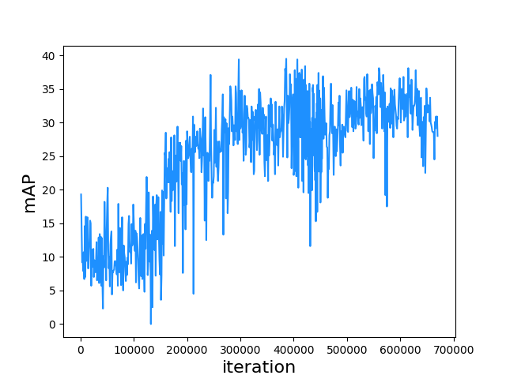
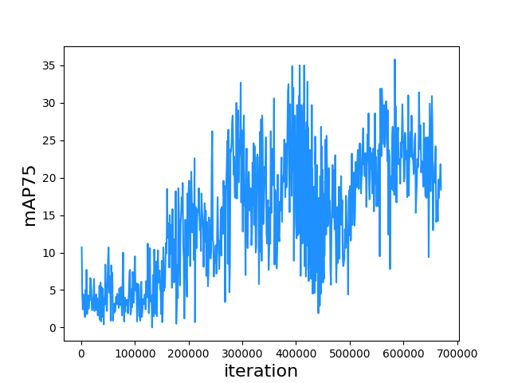
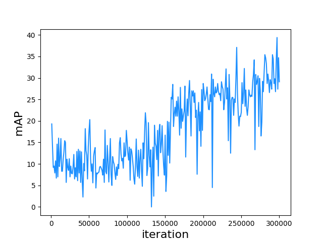
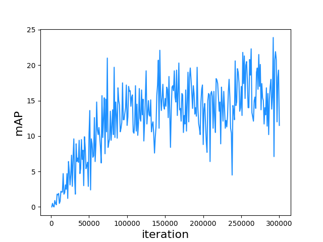
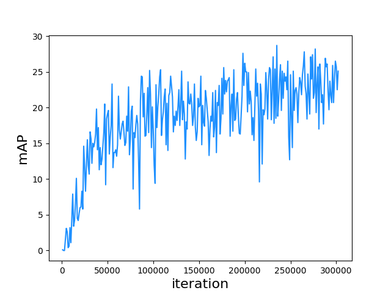
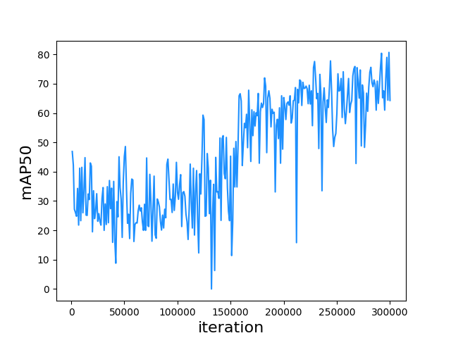
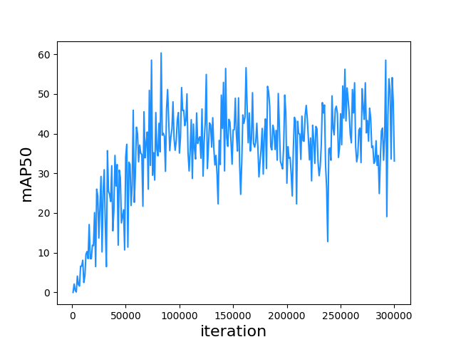
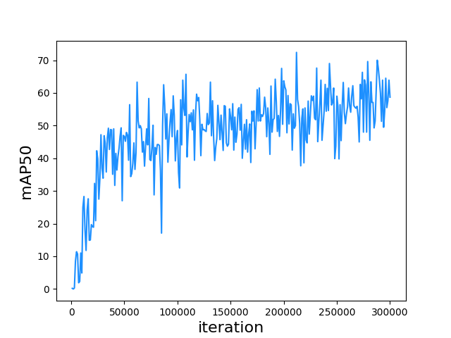

# Appendix
## Appendix A
Full learning state of the proposed model (until 670k iterations).

Figure A.1. mAP to iteration on CD-HARD dataset.

Figure A.2. mAP75 to iteration on CD-HARD dataset.

## Appendix B
Learning states of different backbone networks until 300k iterations.

Figure B.1. Backbone: 2-stack Hourglass, mAP to iteration on CD-HARD dataset.

Figure B.2. Backbone: 1-stack Hourglass, mAP to iteration on CD-HARD dataset.

Figure B.3. Backbone: WPOD-NET [2], mAP to iteration on CD-HARD dataset.

Figure B.4. Backbone: 2-stack Hourglass, mAP50 to iteration on CD-HARD dataset.

Figure B.5. Backbone: 1-stack Hourglass, mAP50 to iteration on CD-HARD dataset.

Figure B.6. Backbone: WPOD-NET [2], mAP50 to iteration on CD-HARD dataset.
