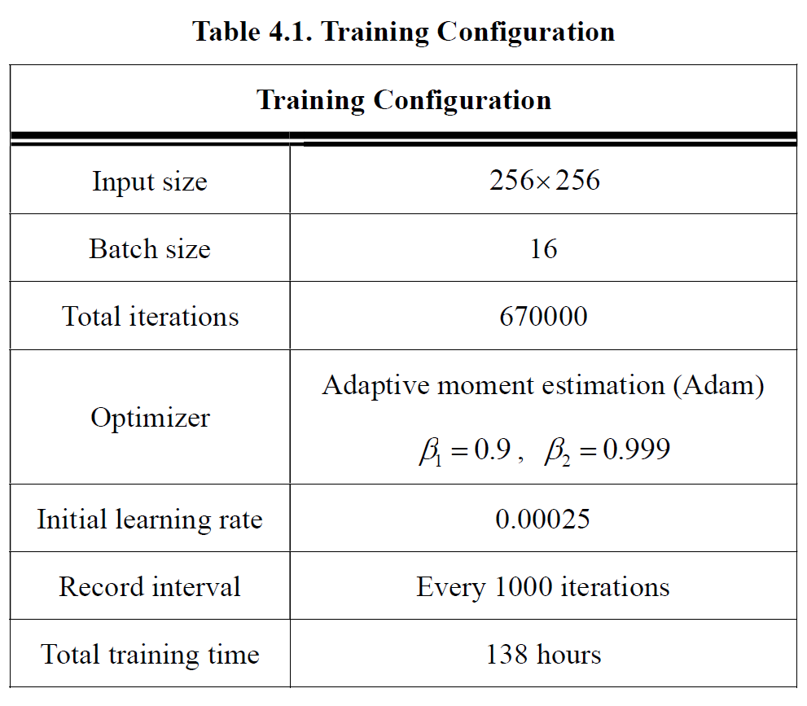
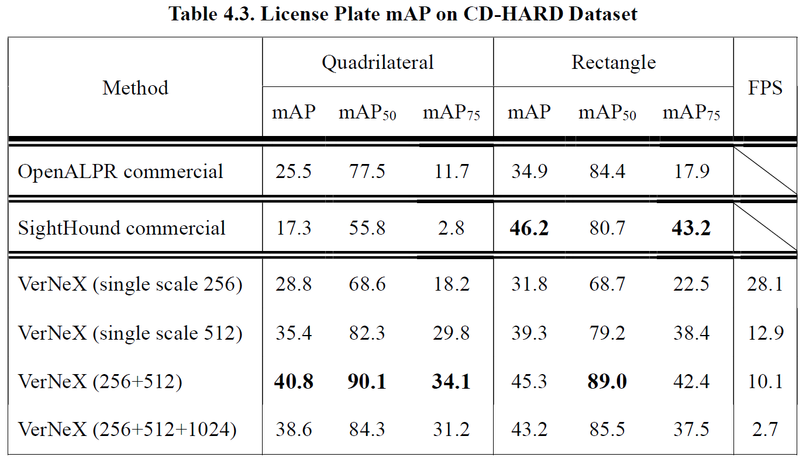
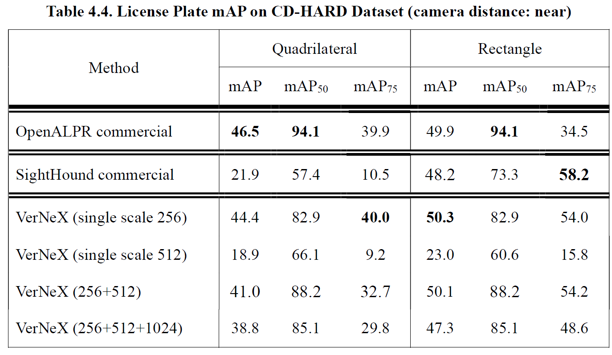
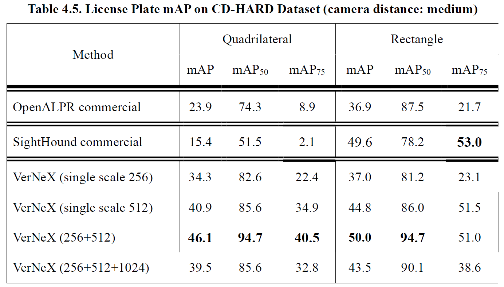
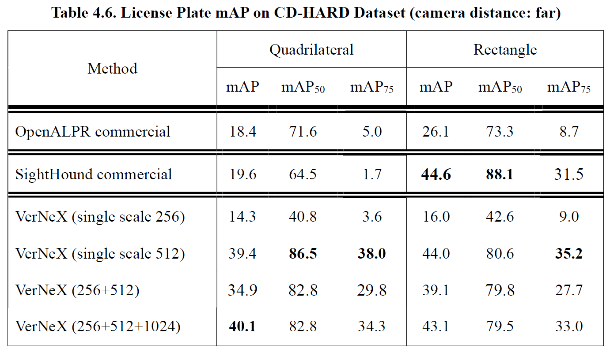
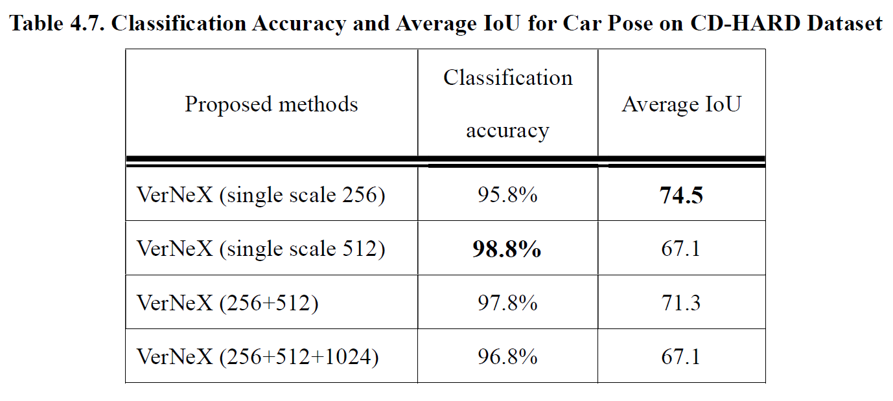
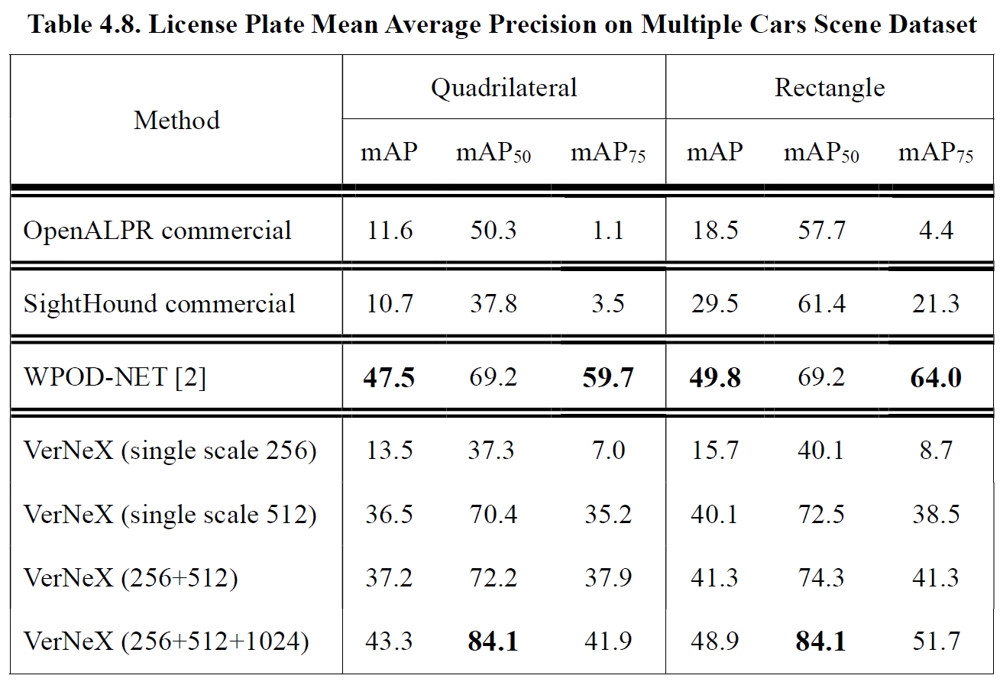
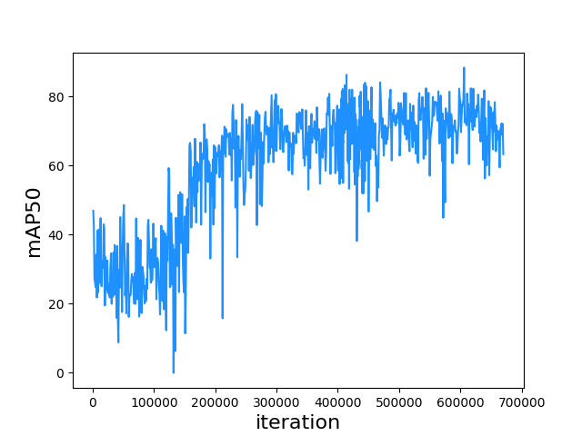
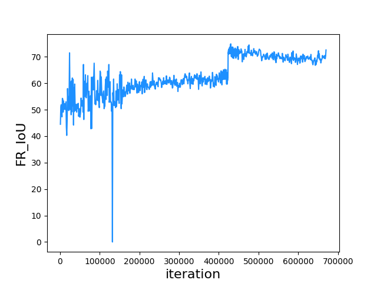
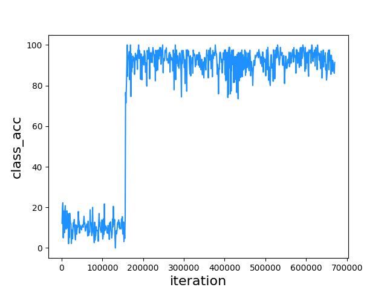

# 4. Experimental Results
This section will first give information about the environment and the data we used in our experiment (4.1). And then show the output result of our model (4.2), including quantitative evaluation on the benchmark dataset and qualitative visualization results. An analysis of the model learning state will then be given in section 4.3.

As mentioned in section 2.4, it is necessary to have a post-processing method for eliminating a large amount of duplicated detection results. All of our final license plate detection results are filtered by a particular NMS method counting on contextual comprehension. Our model will detect a license plate along with the car’s front-rear area, and we assume that only a single license plate will appear in that front-rear region, so we performed NMS on the front-rear region instead of the license plate region. We set the IoU threshold = 0.1, meaning that if there is a slightly overlapped region for two front-rear regions, the license plate detection with a lower confidence score will be removed. We found this method to make the detection results cleaner and more reliable, and thus we applied this method in all of our testing processes. 
## 4.1.	Environment and Data Curation
This section first describes the hardware and software in our experiment. Second, for dataset explanation, it includes choosing appropriate images, annotation demand and criteria, and the prospect of training results. We first describe the data we collected for training and then describe the data served as a benchmark to evaluate our model and compare it with other existing models.
 
### 4.1.1.	Experiment Environment
The training and testing process were on operating system Ubuntu 16.04 LTS with CPU Intel i5-6500 3.20GHz, GPU GeForce GTX1080, DRAM 16GB. We built the system with python 2.7, and the deep learning frameworks are Tensorflow [28] and Keras [29]. The codes are all available online . We also made the codes available for Windows and python 3.7, which can be found on our project website . Table 4.1 lists the configuration we set during the training process.

### 4.1.2.	Training Dataset
Our training data contains three components:

1.Vehicle images from different nations with various camera views

2.Annotation of license plate in either bounding rectangles or bounding quadrilaterals

3.Annotation of vehicle’s front-rear part in either bounding rectangles or bounding quadrilaterals with front-rear class labels

Considering the generalization of our model, we collected images from different countries, including 1. The OpenALPR benchmark dataset with license plates from Brazil, America, and Europe. 2. The CCPD dataset proposed by Xu et al. [30] with Chinese license plates. 3. Proposed Korean license plates dataset, we call it Oblique_KR in the rest of our paper. All of the images have a primary vehicle inside with annotations.

The camera views differed from each dataset, in OpenALPR benchmark dataset, the vehicles are most in their frontal view, the dataset’s license plate annotations are bounding rectangles, in order to eliminate the uncertainty for our model to learn the proper feature of a license plate, license plates with slight rotations were removed in advance since the rectangle bounding boxes can’t perfectly describe the license plate. In the CCPD dataset, the license plate annotations are in vertices, so the license plate can be fully described even the car is in an oblique view or under some rotations. The original CCPD dataset contained 199,993 images, we first chose 2333 images randomly and further chose 346 tilted or rotated images with a high level of horizontal or vertical rotational degree. Lastly, the images in the Oblique_KR dataset were shot under extremely oblique views but with visible characters on the license plate. Table 4.2 lists the overall dataset information. Figure 4.1 gives some examples of OpenALPR and CCPD datasets. Figure 4.2 gives those of Oblique_KR dataset.

For the weather condition in the datasets, most of the pictures are taken under clear weather, some of them are rainy or under low level of foggy weather. Images both in the day-time and night are included, while the license plates are all clearly visible.

For the license plate annotation, OpenALPR datasets are all bounding rectangle annotations with top-left point and bottom-right point, CCPD dataset and Oblique_KR are bounding quadrilateral annotations.

For the front-rear annotations, since none of the existing datasets gave annotations for the vehicle’s front and rear information, we manually annotated all of the images in the datasets mentioned above. Our annotations include 1. The bounding rectangles or bounding quadrilaterals of car’s front-rear region. 2. The pose information of the car (front or rear). The reason for the existence of both bounding rectangles and bounding quadrilaterals is that, for Open-ALPR and CCPD dataset, we used bounding rectangles since the view is not that oblique, so bounding rectangles are enough for describing the front-rear part regions. With respect to the Oblique_KR dataset, we used bounding quadrilaterals since the vehicles are in a high level of oblique angles, bounding quadrilaterals then illustrate the front-rear regions much better than simple bounding rectangles. We used open-source annotation tools [31] [32] to do the annotations.

Our final training dataset includes 3102 of images with various nations and camera views to meet the purpose of training a robust license plate detector to handle the diversity of real-world scenes.
 

### 4.1.3.	Benchmark Dataset
For evaluating our model, we need a benchmark dataset that can closely represent the real-world scenes. Silva and Jung [2] proposed CD-HARD dataset, which is a sub-dataset of Cars Dataset [33]. CD-HARD includes 102 vehicle images with most of the license plates in oblique angles (difficult cases for license plate detection), and the distance of the vehicles ranges from close, medium to far. Weather conditions are most under clear weather in the day-time. We used 101 images in the CD-HARD dataset with a single car inside as our validation dataset (excluding the one with multiple vehicles inside for consistency). In the later section, we use this dataset as a benchmark to compare with other existing systems.

Another benchmark dataset is the Multiple Cars Scene dataset, which is proposed by Kuo et al. [23], the dataset includes 32 images with multiple cars inside a single image. Weather conditions are all under clear weather in the daytime, and the distance of the vehicles is also diverse, with very near vehicles and far vehicles with unrecognizable license plates. This dataset will be used to evaluate the contextual information missing problem mentioned in section 1.3. A comparison between our proposed method and vehicle detection-based license plate detection method [2] will be made on this dataset.

Figure 4.1. Examples of OpenALPR and CCPD dataset.

Figure 4.2. Examples of Oblique_KR dataset.
 
## 4.2.	Performance
Model performance evaluation is divided into qualitative visualization and quantitative evaluation. The qualitative visualization part gives several examples of the detection results on the benchmark dataset and heatmaps for the license plate probability and classification ability. The quantitative evaluation part lists the classification accuracy and mAP performance comparison with existing commercial systems.
### 4.2.1.	Visualization Results
Figure 4.3 shows some examples of the detection results on the CD-HARD dataset, the text above the bounding quadrilaterals of car’s front-rear gives the classification results, Front, Rear, or Unknown for background class. The number followed by class is the output of the Softmax activation function. The license plate probability is also written at the bottom of the bounding quadrilateral. The results shown in Figure 4.3 are done by multi-scale testing with input dimensions 256 and 512, which is also the testing dimension yielding the highest mAP score on the CD-HARD dataset.

Figure 4.4 shows the detection results on the Multiple Cars Scene dataset, this dataset is quite more challenging than the CD-HARD dataset since some of the license plates are relatively small in the images, making it hard to detect with low input dimension, we used multi-scale testing with dimensions 256, 512 and 1024 for those visualization results since it obtained the best mAP on the Multiple Cars Scene dataset.

Figure 4.3. Detection results of CD-HARD dataset .

Figure 4.5 gives some examples of the detection missing issue by vehicle detection-based method mentioned in section 1.3. By utilizing our proposed method, we successfully avoided this issue and found all of the license plates inside the image. This indicates that our method is more reliable when the amount of vehicle inside an image becomes larger since the overlapped situation among vehicles will increase as well.

Figure 4.6 and Figure 4.7 visualize the license plate probability for each pixel and the classification ability of the model by plotting the distribution of those high probability pixels. Our model can locate the license plate within a precise region and tell all the possible pixels for the car’s front and rear.
 

Figure 4.4. Detection results of Multiple Cars Scene dataset .

Figure 4.5. Comparison between vehicle detection-based license plate detection [2] (left column) and proposed method (right column). On the left side, license plate detection missing appeared due to the false regression of license plate; on the other hand, our proposed method can avoid those cases and find all of the license plates.

Figure 4.6. Heatmap of CD-HARD dataset.
(a): Input image (b): License plate probability (c): Front probability (d): Rear probability 
 
 
 

Figure 4.7. Heatmap of Multiple Cars Scene dataset.
(a): Input image (b): License plate probability (c): Front probability (d): Rear probability
### 4.2.2.	Quantitative Evaluation
Mean Average Precision (mAP) is often used for the evaluation of an object detector. The average precision refers to the average value of the precisions with different recalls and is calculated for each class individually. Mean average precision then refers to the arithmetic mean value of the average precisions of all of the classes. To be clear, although we only have one class (license plate) in the model, in our evaluation, we still used the term mAP for consistency. Before moving on to the quantitative evaluation, in the following contents, we will first declare the different mAP metrics that might be confusing.

The early calculation method for mAP is proposed by the Pascal VOC challenge, they calculated the 11 points of precision values by interpolation with recall value from 0 to 1.0 with an interval of 0.1. The average precision is then calculated by the average of those precision values. In Pascal VOC mAP, they treat the detection result as a true positive detection if the IoU with the ground-truth label is larger than 0.5.

Since recent object detection research tended to move to MS COCO dataset as a benchmark, we used the new metric for mAP calculation proposed in MS COCO. They used 101 points of precision values by interpolation with recall value from 0 to 1.0 with an interval of 0.01. Different from the Pascal VOC metric, they treat a detection as a true positive detection under different IoU threshold settings. The main metric, mAP, refers to the average mAP calculated by 10 IoU thresholds from 0.5 to 0.95 with interval 0.05. mAP50 refers to the mean average precision with IoU threshold = 0.5. While the most strict metric, mAP75, is the mean average precision with IoU threshold = 0.75. We used the MS COCO calculation method for all of our evaluations; for reference, mAP50 will be the most similar metric compared to the Pascal VOC metric.

Table 4.3 lists the mAP evaluation on the CD-HARD dataset, for the proposed VerNeX with a single testing scale dimension 512, we got bounding quadrilateral mAP score better than both commercial systems OpenALPR (system with bounding quadrilaterals) and SightHound (system with bounding rectangles). With multiscale testing, we reached the best mAP score of 40.8, which outperformed OpenALPR by 15.3 mAP. With respect to the bounding rectangle, we also achieved the highest mAP50 score among the systems and a similar level of performance on mAP and mAP75.

Performance evaluations under different camera distances are given in Table 4.4 (near), Table 4.5 (medium) and Table 4.6 (far). We separated the CD-HARD dataset into three sub-datasets of near, medium and far distance. The camera distance is measured by the ratio between the license plate size and the image size, we used k-means clustering method to separate them with center points 0.077 (near), 0.050 (medium) and 0.035 (far).

 

Table 4.7 shows the classification accuracy and average IoU for car pose. The classification results are all higher than 95%, and the best result is 98.8% on the single scale testing with dimension 512. Best average IoU value 74.5 came out at a single scale 256 since the front-rear region of a vehicle can be viewed as a large object, and thus the small testing scale will yield a better result [34].

Table 4.8 shows the mAP results on the Multiple Cars Scene dataset. Our method outperformed commercial systems with a large gap. WPOD-NET [2] has the highest mAP/ mAP75 score since it is a two-stage license plate detector and yields more refined bounding boxes. However, for mAP50, our model surpassed WPOD-NET by 14.9 mAP to 84.1 mAP, the critical factor of the performance improvement is that our model avoided the missing license plate issue and push the boundary of recall ability further.

## 4.3.	Discussion
The learning states for each functional head are shown in Figure 4.8, Figure 4.9 and Figure 4.10. The states are the results of single-scale testing with a dimension of 512. This section is strongly related to section 3.3.3 and Figure 3.9, referring them will have better comprehension.

For the license plate mAP50 performance in Figure 4.8, the model learned fast in the early 300k iterations, after that, the learning state became steady and tended to be overfitting after 600k iterations. The training settings modifications at 330k and 434k described in section 3.3.3 fine-tuned the model slightly to get mAP50 beyond 80, but the Oblique_KR dataset did not significantly benefit the mAP for the CD-HARD dataset since the obliqueness levels in the CD-HARD dataset is not that heavy as the ones in the Oblique_KR dataset.

The IoU performance of the front-rear region is shown in Figure 4.9. A leap can be observed after 400k iterations, which was the benefited result from the label encoding strategy at 423k mentioned in section 3.3.3. This gave us an insight that a proper design of the labeling strategy can undoubtedly have a massive effect on the performance of a supervised learning object detector.

The classification task is relatively easy for our model to learn, as shown in Figure 4.10, the classification had already reached high accuracy in the early iterations. Nevertheless, the accuracy is quite low before 156k iterations, that was due to the wrong label strategy in our early design, we labeled the front-rear region by the same method used in region regression, which led to a limited region for ground-true labels. Observing the situation, we modified the label encoding strategy immediately and solved the issue. The strategy has been described in section 3.2.2.

The states for mAP and mAP75 performance can be found in Appendix A. As a comparison, we also trained other models based on different backbone networks, and their learning states can be found in Appendix B.

Figure 4.8. mAP50 to iteration on CD-HARD dataset.

Figure 4.9. Front-rear IoU to iteration on CD-HARD dataset.

Figure 4.10. Classification accuracy to iteration on CD-HARD dataset.
