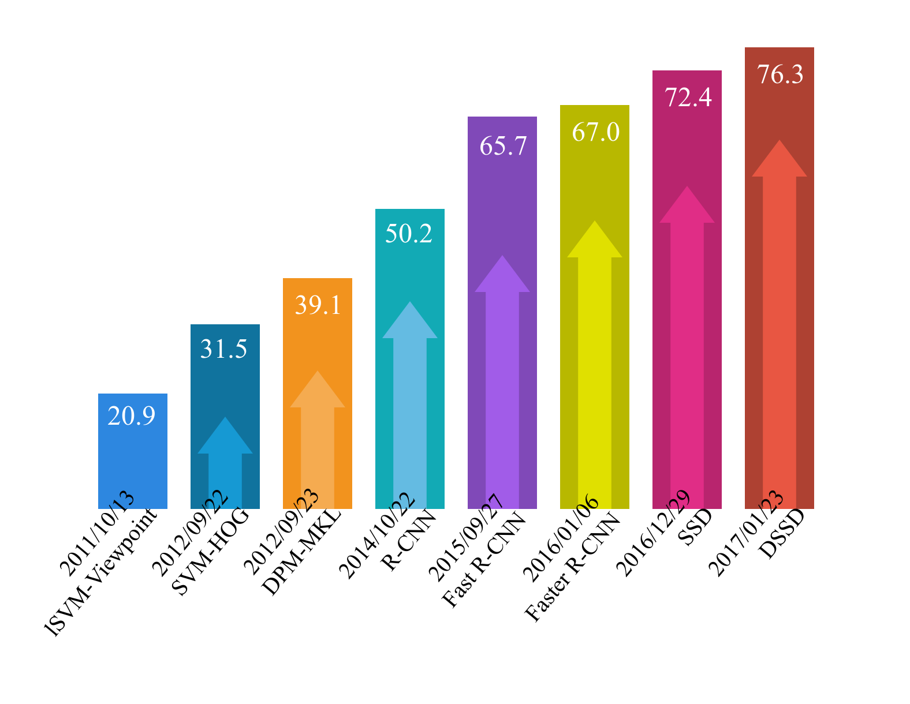
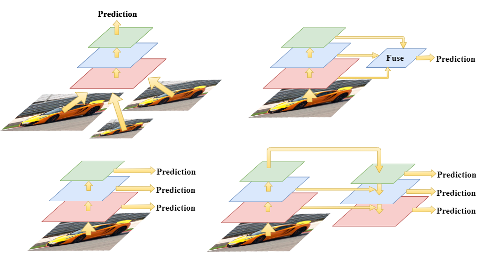
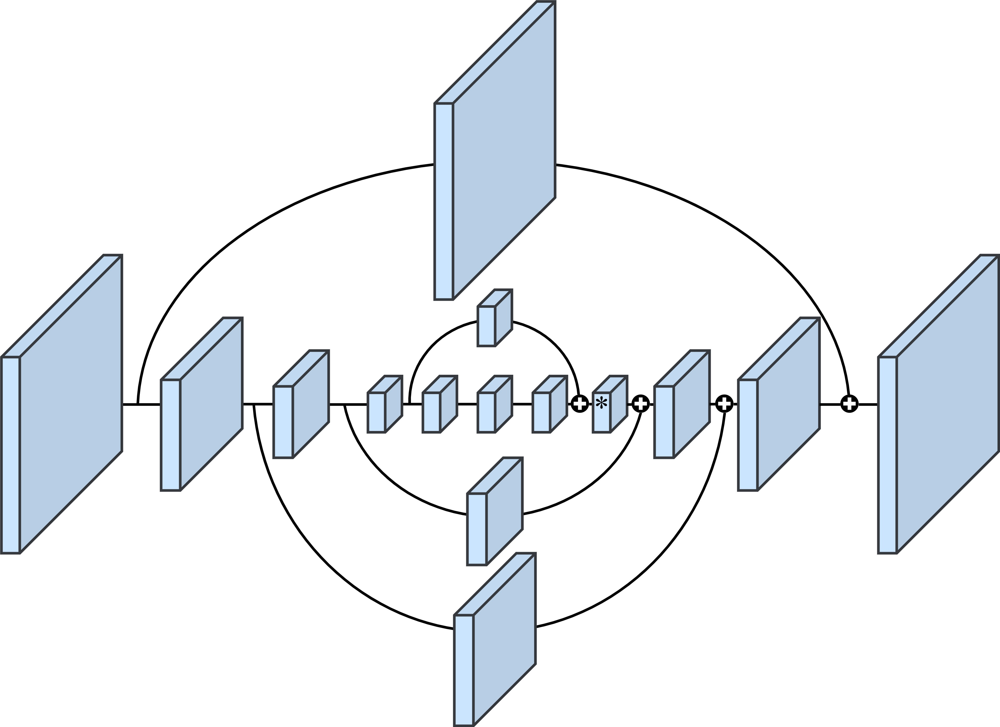
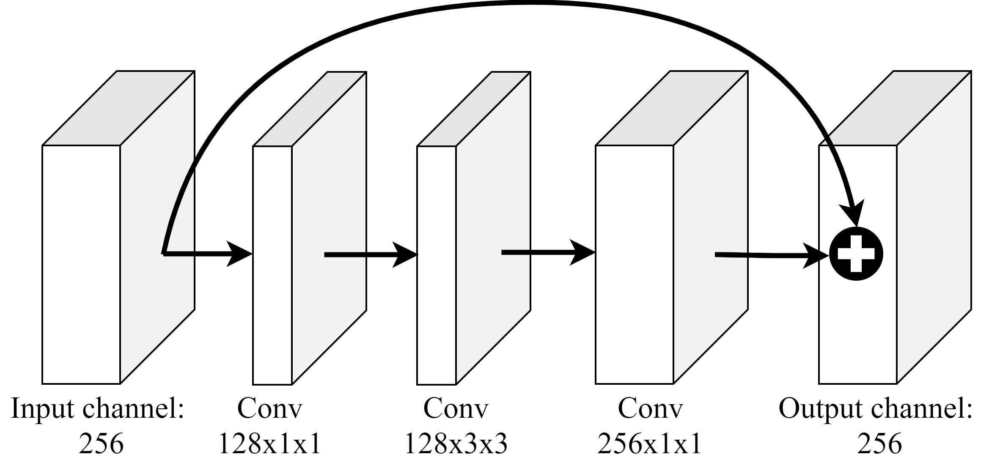
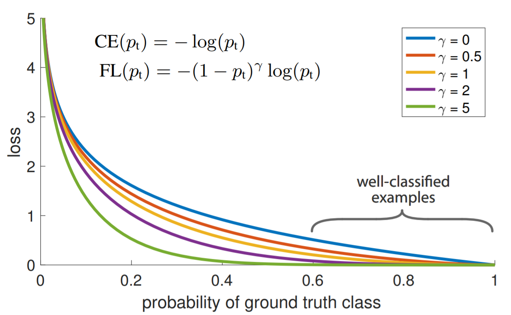
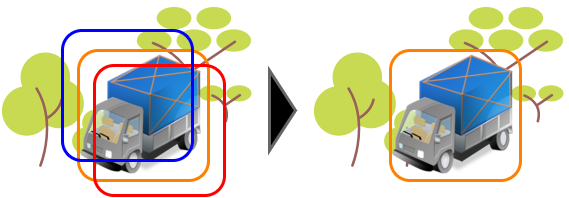

# 2. Related Work
This chapter reviews the technics related to deep learning object detectors, the designing pipe-line of an object detector includes: 
1.	Purpose-oriented model architecture design (2.1, 2.2).
2.	Training methods, which involve a broad range of topics, for example, the choice of quality training data and handling the inevitable over-fitting problems in deep learning studies. For object detection, a procedure called hard negative mining is especially cru-cial since unlike classification problem, the training process of an object detector will have a bunch of back-ground samples (or called negative samples) and relative-small amount of positive samples, hard negative mining is the method for dealing with the un-balanced sample amount between positive and negative ones which may hurt the detec-tor's performance (2.3).
3.	Post-processing procedure for eliminating the duplicated detection results (2.4). 
## 2.1.	Object Detectors
A popular benchmark for object detection is the Pascal Visual Object Class (VOC) challenge, the version released in 2012 [4] includes 11,530 images with 20 classes and 27,450 bounding box annotations in the training and validation dataset. Figure 2.1 shows the mAP (mean Av-erage Precision) increasing trend for the Pascal VOC challenge, the first three methods are based on traditional visual descriptors like Histogram of Gradient (HOG) used in SVM-HOG and Scale-Invariant Feature Transform (SIFT) used in DPM-MKL.
	After 2013, deep learning-based detection methods almost dominate the Pascal VOC challenge, including Region-based Convolutional Neural Network (R-CNN) [5] and its ex-tensions Fast R-CNN [6] and Faster R-CNN [7], SSD [8] and its extension DSSD [9], after 2017, the newly released state-of-the-art detectors are still improving their detecting ability but tend to shift to another more challenging benchmark MS COCO [10] which has 80 categories. The deep learning-based object detectors broke through the limitation of traditional detectors and made a tremendous improvement in mAP scores. This section will introduce several fa-mous object detectors and related algorithms. 

Figure 2.1. The trend chart of mAP in the Pascal VOC 2012 object detection challenge, the statistics are obtained from either Pascal VOC official website or directly presented by paper authors. The training dataset might differ since some of the papers used an amplified training dataset. 
### 2.1.1. Overview of Recent Trend
Recent object detectors can be categorized into two branches, One-Stage detectors, and Two-Stage detectors, one-stage detectors make the region proposal for finding Region Of In-terests (ROI) and object classification at the same time, while two-stage detectors first find the ROI and feed those ROIs into the classification process. There is a trade-off between one-stage detectors and two-stage detectors, one-stage detectors tend to have lower computa-tional cost and thus have faster processing speed, while two-stage detectors tend to have higher performance since the region proposal part is separated, which leads to better ROI qualities, result in better classification results and tighter bounding boxes. 
	R-CNN family is the frontrunner in Two-Stage object detectors, which was first pro-posed by Girshick et al. [5], this version first does region proposal done by selective search [11] and then feeds those ROIs into a convolutional neural network individually for classifica-tion and bounding box regression. Because those ROIs actually partly cover the same pixels with each other and result in duplicate computation and huge computational cost, to solve this problem, Girshick [6] proposed Fast R-CNN, they feed an image into the CNN only one time and by using ROI pooling, they resize the feature map of ROIs into a fixed-size feature, and then further feed them into a fully-connected network to do classification and bounding box regression. They reduced the training and testing time by around ten times compared to R-CNN. But there is still a problem in the pipeline of Fast R-CNN, the region proposal part is still based on the traditional method (i.e., selective search). Thus their model is unable to op-timize in an end-to-end manner. Faster R-CNN [7] addressed this problem and proposed Re-gion Proposal Network (RPN), RPN is trained by fitting the default anchor boxes to ground-truth bounding boxes, RPN substituted selective search to make region proposal and finally made the training pipeline end-to-end. 
	For One-Stage detectors, the first appearance is OverFeat [12], they combined the local-ization and classification within a single network, SSD [8] proposed a method doing region proposal with the concept of anchor box used in RPN in Faster R-CNN along with doing bounding box regression and classification at the same time, SSD reached competitive per-formance compared to two-stage detectors, DSSD [9] is the enhanced version of SSD which introduced the deconvolutional process in their network. YOLOv3 [13] also obtained re-markable results by utilizing multi-scale feature maps inside the network. RetinaNet [14] in-troduced Focal Loss to handle the unbalanced sample problem, Focal Loss will be explained in section 2.3. CornerNet [15] is a key-point based method that finds the top-left and bot-tom-right points of an object and further performs bounding box refining. Zhu et al. [16] pro-posed an anchor-free method (region proposal without anchor boxes), which can be applied to one-stage detectors, with the combination of anchor-based method and anchor-free method, they achieved the state-of-the-art object detection results. Table 2.1 lists the components in the recent object detectors.

Table 2.1. Components of Object Detectors
Object Detectors
Detection 
Paradigms	Feature
Extraction	Proposal
Generation	Backbone
Architecture
One-Stage
Two-Stage	Image Pyramid
Detection Pyramid
Integrated Features
Feature Pyramid	Anchor-Based
Anchor-Free	VGG16 [17]
ResNet [18]
Hourglass Net [19]

### 2.1.2.	Feature Extraction
To generate final object detection results, an encoding method for image information is nec-essary, and this is often called feature extraction in the object detection task, lots of convolu-tional neural network architectures are designed for this purpose, the CNN architecture used for feature extraction is then viewed as backbone architecture.
	On top of the backbone architecture, how to utilize the feature map generated in different inner layers of the network has been studied widely in recent years. In the convolutional neu-ral network, a sequence of downsampling process will be performed, in this process, early layers with high resolution often have richer spatial information and weaker semantic infor-mation, deeper layers with lower resolution often have less spatial information but more se-mantic information. This leads to a property that early layers are good at detecting small ob-jects but lack of the ability to recognize and classify object categories, on the other hand, deeper layers are short of finding small objects but more capable of categorizing objects and more robust on different translation, illumination, and transformation of an object.
	Object detectors like Faster R-CNN and YOLO, they detect the object by only utilizing the final output feature map, to overcome the spatial information-lacking problem, a method is to intuitively, train one detector with different scales of images or to train several detectors with each detector handling different sizes of images and then combine the results. This pro-cess is called Image Pyramid and shown at the top left in Figure 2.2. This method could be computationally expensive since we need to feed the image several times at the training and testing stage. 
	Later, SSD [8] used Detection Pyramid, which is shown at the bottom left in Figure 2.2. They utilized the inner layer’s feature map in the backbone CNN and then performed predic-tion at different resolutions. Since the early layers contain spatial information for grabbing small objects, it makes the multi-scale object detection possible within a single network. However, the problem is, we still need to do several times of detections and combine the re-sults.
	Stacked Hourglass Network [19] and U-Net [20] are designed under another concept, Integrated Features, shown at the top right in Figure 2.2. They fuse the interior features and perform the prediction on a single output map taking advantage of utilizing multi-scale fea-tures, and only single detection is needed. In our research, the model we used is based on Hourglass Network. The base architecture of the Hourglass Network is described in section 2.2, and our model design is in section 3.1.1.
	Combining the concept of both Detection Pyramid and Integrated Features, Feature Pyramid [21] was proposed, which is at the bottom right in Figure 2.2. They first fuse the features extracted from different levels of layers, perform the detection in each level, and then further combine the detection results. RetinaNet and YOLOv3 adopted Feature Pyramid and obtained promising results. Although Feature Pyramid is experimented to yield the best detec-tion results, considering the trade-off between performance and inference time, we chose In-tegrated Features as our final feature extraction choice since the applications of license plate detection task often prefer real-time processing.

Figure 2.2. Different feature extraction methods.
### 2.1.3.	Region Proposal Methods
Anchor-based:
Before the era of deep learning, Selective Search [11] was a simple and reliable region pro-posal method. However, the critical drawback is the disability for a model to train and opti-mize end-to-end when applying Selective Search. In the case of R-CNN, they originally used Selective Search as their region proposal method and introduced Region Proposal Network (RPN) later in Faster R-CNN, making the region proposal process be a neural network as well. In the training process of RPN, several manually designed default anchor boxes will be regressed to ground-truth bounding boxes with refining parameters, after the RPN has been appropriately trained, at inference time, the anchor boxes with high object-existing probability will be treated as a potential region proposal, the others will be treated as background.
	Anchor-based method almost dominates the region proposal part among recent object detectors because of its ability to detect objects in different aspect ratios and sizes, proposing multiple objects within a single grid is also possible by applying anchor-based method. But the designing and choosing of anchor box’s aspect ratios and sizes are all manually decided, as the process is done in a heuristic manner, it might be a limitation for a network to bring out their best potential. Some efforts have been made to choose better anchor box, Redmon and Farhadi [22] used k-means to cluster the training data for obtaining anchor boxes with more preferable aspect ratios, our previous work for detecting vehicle’s front and rear also intro-duced k-means clustering to decide the default anchor boxes [23]. 
	Although the refined method for defining anchor box does not count on heuristic design anymore, the large variety of aspect ratios and sizes of objects around the world are not even possible contained by a limited amount of anchor boxes, so here we state the potential prob-lems of anchor-based method:
1.	Anchor box designed by referencing training data might not be compatible with real cases.
2.	The concept of anchor box is not natural since it is not possible to represent the abundant object categories in the world with a limited amount of anchor boxes.
Anchor-free:
Early one-stage object detectors like Overfeat [12] and YOLO [24], their region proposal stage was anchor-free design, YOLO treated the bounding box refining as a regression prob-lem, so the region proposal and classification tasks are all done by a series of CNN followed by fully-connected layers.
	After that, anchor-free method lost its attention for several years after RPN [7] brought out their anchor-based method. Nevertheless, recently, CornerNet [15] and CenterNet [25] put efforts on constructing anchor-free object detectors. CornerNet tried to find the top-left and bottom-right corners of an object instead of finding bounding box, they proposed a novel pooling method called Corner pooling, which encodes the corner message of an object and is claimed to be the critical stage for the success of CornerNet. CenterNet first predicted the bounding boxes by pairs of corners and then predicted the center probabilities for an object to exist. It is based on extracting the information of the center and the corners of an object. Both of the anchor-free object detectors obtained promising results. CenterNet presents their best Average Precision (AP) on MS COCO dataset as 47.0, surpassing all of the previous one-stage object detectors and most of the previous two-stage detectors.
	Inspired by the impressive results of CornerNet and CenterNet, our region proposal method is designed under the concept of anchor-free method and is described detailedly in section 3.1.2 and 3.1.3.
## 2.2.	Stacked Hourglass Network
Stacked Hourglass Network [19] was first designed for human pose estimation, it is a feature extraction backbone with several Hourglass Networks connected together. A single Hourglass Network is shown in Figure 2.3, the architecture of Hourglass Network is a sequence of down-sampling CNN followed by a sequence of up-sampling CNN. To utilize the feature with rich spatial information (shallow part of CNN) and feature with rich semantic infor-mation (deeper part of CNN), there’re lateral connections that merge the early features with latter features, it’s the central concept of Hourglass Network and make it suitable for object detection tasks since the spatial information often disappears in the latter part of a simple CNN architecture.
Each block (except the block with * mark) in Figure 2.3 refers to a residual block shown in Figure 2.4. Residual block was first proposed by He et al. [18], a skip connection from in-put layer directly to output layer was added, it was designed to address the problem of gradi-ent vanishing problem when training a deep neural network, when the network goes deeper, information from shallower layer might disappear due to the gradient-based back-propagation, residual block makes it possible to train a network as deep we want. The channel amount (kernel amount) is basically 256 in the entire Hourglass Network, as we can see in the input and output of the residual block. Inside the residual block, there are two CNNs with 128 channels with kernel sizes 1 and 3, followed by a CNN with 256 channels with kernel size 1. Stacked Hourglass Network was used for feature extraction backbone network in recent ob-ject detection researches like CornerNet and CenterNet.

Figure 2.3. Hourglass Network. The block with * mark refers to simple feature addition, other blocks refer to residual blocks.

Figure 2.4. Residual block used in Hourglass Network.
## 2.3.	Focal Loss
Focal Loss [14] is an optimization strategy aiming at handling imbalanced samples. Since in the training process of an object detector, ground-truth positive labels are always less than ground-truth negative labels with a huge gap. To prevent the loss created by the ground-truth negative labels overwhelming the training stage, methods for handling this problem is essen-tial and often called hard negative mining. 
	Controlling the data feeding during the training process like Online Hard Example Min-ing (OHEM) [26], and forcing the ground-truth positive and ground-truth negative ratio to be 1:3 in SSD [8] are some of the methods for hard negative mining. 
	Instead of directly handling the training samples fed into the model, Focal Loss tried to handle this problem by controlling and giving different weights to the loss created by easy-samples and hard-samples, and the name ‘Focal’ refers to ‘Focusing’ on hard-samples.
	  	2.3.1
	 	2.3.2
	 	2.3.3
FL is the formula of Focal Loss, it can be considered as an extended form of Cross-Entropy loss. A factor   is added for controlling the loss weight, which ranges between 0 and 1, y is relevant to the ground-truth label, for positive samples, y equals to 1, otherwise equals to 0. Say we set   to 0.9, the weight contribution ratio between ground-truth positive samples and ground-truth negative samples will then become 9:1 (0.9:0.1). Adding   is able to ad-just the contribution between positive samples and negative ones, but not considering the easy cases and hard cases. 
	To make the model focus on the hard cases which are more difficult to learn, the term   is added.   is the object-probability output of an object detector, it will be close to 1 when it’s true-positive or true-negative and close to 0 when it’s false-positive or false-negative. γ is a factor to control the weight decay for easy-samples,   will be close to 0 if the model makes true predictions while close to 0 on the other hand, with γ value larger than zero, the loss caused by true predictions (easy-samples in the early stage of learning) will be shrunk and the loss caused by false predictions will remain the same. When γ equals zero, then the loss function is the same as Cross-Entropy loss. The difference be-tween Focal Loss with various values of γ and Cross-Entropy loss is mentioned in the original paper and shown in Figure 2.5.
	In our work, we used extended forms of Focal Loss in the localization loss and classifi-cation loss and described them in section 3.2.1.

Figure 2.5. Focal Loss [14]. The Cross-Entropy loss is the curve with γ= 0. The loss with larger   value diminished eminently with different levels depending on the value of γ. 
## 2.4.	Non-Maximum Suppression (NMS)
In the test stage of an object detector, the output object probability larger than a decided threshold will be considered a positive detection result. There will be a massive amount of duplicated bounding boxes for a single object, to eliminate the duplicated ones and keep the most-likely one, we often perform Non-Maximum Suppression (NMS).
	Equation 2.4.1 shows the process of NMS, NMS first arranges all of the detection results according to their probability score ( ) of having an object in descending order. Let M be the result with the highest score, compare the results B having less score than M, if the In-tersection over Union (IoU) between M’s bounding box and B’s bounding box is greater than a specific threshold  , then the score of B will be set to zero, or to say remove the detec-tion result of B, else if the IoU is smaller than  , B will remain there. This process per-forms iteratively until the detection result with the lowest score has been checked. Figure 2.6 gives an example of bounding box removal.

	 	2.4.1

 

Figure 2.6. Illustration of Non-Maximum Suppression (NMS), the bounding box which best fits the object has the highest score. The other two bounding boxes are removed, assuming their IoUs with the best box are larger than the testing threshold  .
